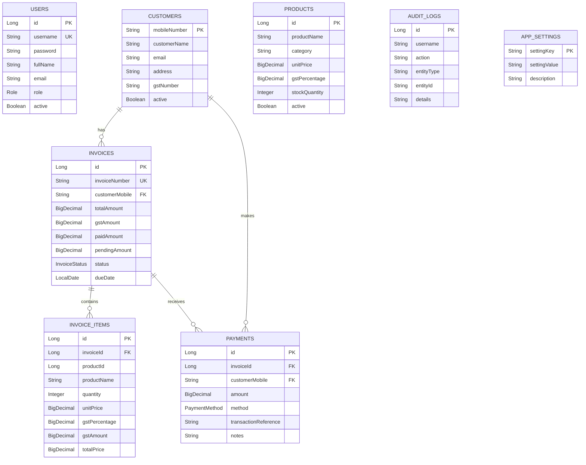

# BillCraft Desktop — Architecture

## Overview

BillCraft Desktop (branded "AVP Nexus") is a fully offline, installable Windows desktop billing application designed for furniture and wood shops in India. It bundles four layers into a single distributable package:

```
┌─────────────────────────────────────────────────────────────────┐
│                      Electron Shell (v33)                        │
│  ┌───────────────────────────────────────────────────────────┐  │
│  │              React 18 + MUI 6 Frontend                    │  │
│  │         (TypeScript, SPA served from local files)         │  │
│  └───────────────────────────────────────────────────────────┘  │
│                              ↕ HTTP (localhost:8080)             │
│  ┌───────────────────────────────────────────────────────────┐  │
│  │          Spring Boot 3.3.5 Backend (Java 21)              │  │
│  │              (REST API, JWT Auth, PDF Gen)                 │  │
│  └───────────────────────────────────────────────────────────┘  │
│                              ↕ JDBC                              │
│  ┌───────────────────────────────────────────────────────────┐  │
│  │              H2 Database (File-based)                      │  │
│  │           (~/.billcraft/data/billcraftdb)                  │  │
│  └───────────────────────────────────────────────────────────┘  │
└─────────────────────────────────────────────────────────────────┘
```

## Project Structure

```
billcraft-desktop/
├── settings.gradle              # Gradle multi-project settings
├── gradlew.bat                  # Gradle wrapper (Java 21)
├── build.bat                    # 5-step full build script
├── make-installer.bat           # Builds + creates NSIS installer
├── BillCraft.vbs                # Silent launcher (no terminal window)
├── create-shortcut.bat          # Creates Windows desktop shortcut
├── launch.bat                   # Alt launcher (shows terminal)
├── README.md                    # Project overview
│
├── springboot-backend/          # ── Spring Boot REST API ──
│   ├── build.gradle             # Dependencies & build config
│   └── src/main/
│       ├── java/com/billcraft/
│       │   ├── BillCraftApplication.java
│       │   ├── config/          # Security, Web, JWT config
│       │   ├── controller/      # REST endpoints
│       │   ├── dto/             # Request/Response objects
│       │   ├── entity/          # JPA entities
│       │   ├── repository/      # Spring Data JPA repos
│       │   ├── security/        # JWT filter, token provider
│       │   └── service/         # Business logic
│       └── resources/
│           ├── application.yml  # App configuration
│           └── db/migration/    # Flyway SQL migrations
│
├── electron-app/                # ── Electron Desktop Shell ──
│   ├── main.js                  # Main process (lifecycle, IPC, backend mgmt)
│   ├── preload.js               # Context bridge (IPC → renderer)
│   ├── splash.html              # Loading screen
│   ├── package.json             # Electron + builder config
│   ├── assets/                  # Icons (ICO, PNG, SVG)
│   └── renderer/               # ── React Frontend ──
│       ├── package.json         # React + MUI dependencies
│       ├── public/index.html    # HTML shell
│       └── src/
│           ├── App.tsx          # Router, theme, auth guard
│           ├── context/         # AuthContext (JWT management)
│           ├── services/        # Axios API client modules
│           ├── components/      # Layout, shared components
│           └── pages/           # Feature pages (10 pages)
│
├── runtime/jre/                 # Bundled JRE (jlink custom image)
├── tools/node-v20.18.0-win-x64/ # Bundled Node.js for dev
├── installer/output/            # Built installer/portable output
└── docs/                        # Documentation
```

## Layer Architecture

### Layer 1: Electron Shell (`electron-app/main.js`)

The Electron main process is the application orchestrator responsible for:

| Responsibility | Implementation |
|---------------|----------------|
| Single Instance Lock | `app.requestSingleInstanceLock()` |
| First-Run Setup | Wizard dialog → saves `~/.billcraft/config.json` |
| Backend Lifecycle | Spawns `java -jar`, health polling, graceful shutdown |
| Window Management | Splash → Main window (1400×900), system tray |
| Native Features | File dialogs, OS notifications, PDF printing |
| IPC Bridge | `ipcMain` handlers for renderer ↔ native communication |

### Layer 2: React Frontend (`electron-app/renderer/`)

Single-page application loaded from local build files:

| Aspect | Details |
|--------|---------|
| Routing | HashRouter (10 routes) |
| State | React Context (AuthContext) + component state |
| API Client | Axios with JWT interceptors |
| UI Framework | MUI 6 + MUI X DataGrid + Recharts |
| Auth | JWT token in localStorage, auto-redirect on 401 |

### Layer 3: Spring Boot Backend (`springboot-backend/`)

Embedded REST API running on `localhost:8080`:

| Aspect | Details |
|--------|---------|
| Framework | Spring Boot 3.3.5, Java 21 |
| Security | Stateless JWT, BCrypt passwords |
| Database | Spring Data JPA + H2 (file mode) |
| Migrations | Flyway (versioned SQL scripts) |
| PDF Gen | OpenPDF (A4 invoices + thermal receipts) |
| Export | Apache POI (Excel), OpenCSV (CSV) |
| Scheduling | Auto-backup every 24 hours |
| Actuator | Graceful shutdown endpoint |

### Layer 4: H2 Database

| Aspect | Details |
|--------|---------|
| Mode | File-based (persistent) |
| Location | `~/.billcraft/data/billcraftdb` |
| Compatibility | LEGACY mode (MySQL-compatible SQL) |
| Backup | H2 `SCRIPT TO` / `RUNSCRIPT FROM` (SQL format) |
| Migrations | Flyway V1 (schema) + V2 (seed data) |

## Domain Model



## API Architecture

All REST endpoints are prefixed with `/api/v1/`:

| Controller | Base Path | Purpose |
|-----------|-----------|---------|
| AuthController | `/auth` | Login, registration |
| CustomerController | `/customers` | Customer CRUD |
| ProductController | `/products` | Product catalog management |
| InvoiceController | `/invoices` | Invoice lifecycle + PDF |
| PaymentController | `/payments` | Payment recording |
| ReportController | `/reports` | Sales, GST, analytics |
| BackupController | `/backup` | Backup/restore |
| SettingsController | `/settings` | App configuration |
| UserController | `/users` | User management |
| AuditLogController | `/audit-logs` | Activity tracking |
| NotificationController | `/notifications` | Reminder configuration |
| HealthController | `/health` | Health check |

## Security Architecture

```
┌─────────────┐    ┌──────────────┐    ┌─────────────────┐
│   Request   │───→│ JwtAuthFilter│───→│ SecurityContext  │
│ (Bearer JWT)│    │  validates   │    │ (authenticated) │
└─────────────┘    └──────────────┘    └─────────────────┘
                          │
                          ↓ (if invalid/missing)
                   ┌──────────────┐
                   │  401 Response│
                   └──────────────┘
```

- **Token Format:** HMAC-SHA signed JWT with username (subject) + role claim
- **Expiration:** 24 hours
- **Storage:** Client-side (localStorage)
- **Password Hashing:** BCrypt
- **Public Endpoints:** `/api/v1/auth/**`, `/api/v1/health`, `/actuator/**`

## Data Storage

| Data Type | Location | Format |
|-----------|----------|--------|
| Application DB | `~/.billcraft/data/billcraftdb` | H2 file |
| Config | `~/.billcraft/config.json` | JSON |
| Backups | `~/.billcraft/backups/` | SQL scripts |
| Logs | `~/.billcraft/logs/` | Text |
| Renderer | `electron-app/renderer/build/` | Static HTML/JS/CSS |

## Communication Patterns

### Frontend → Backend (HTTP)
```
React Component → api.ts (Axios) → localhost:8080 → Controller → Service → Repository → H2
```

### Frontend → Native (IPC)
```
React Component → window.electronAPI.method() → preload.js → ipcRenderer → main.js → Native API
```

### Backend Startup (Health Polling)
```
main.js spawns Java → polls GET /api/v1/health every 500ms → 200 OK → show main window
```

### Graceful Shutdown
```
App close → POST /actuator/shutdown → wait 5s → tree-kill process → app.quit()
```
