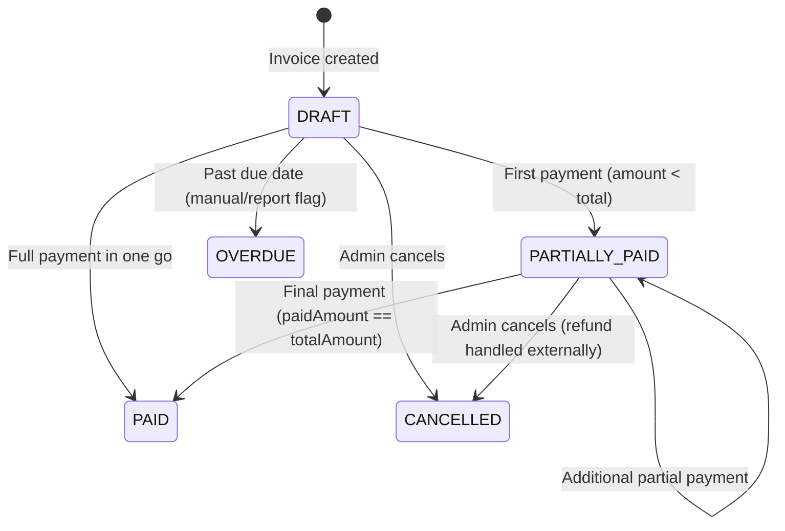

# BillCraft Desktop — Critical Processes

This document explains the most important and complex processes in the application with detailed technical breakdowns.

---

## 1. Backend Lifecycle Management

### Problem
The React frontend needs a running Spring Boot server on `localhost:8080`, but this is a desktop app — there's no pre-running server. The Java backend must be started, monitored, and cleanly stopped by Electron.

### Implementation (`electron-app/main.js`)

#### Startup Sequence

```javascript
// 1. Resolve JRE path (priority order)
function findJavaPath() {
  // a) Bundled JRE: runtime/jre/bin/java.exe (production)
  // b) Dev JRE: ../../runtime/jre/bin/java.exe
  // c) System Java: 'java' command in PATH
}

// 2. Spawn backend as child process
backendProcess = spawn(javaPath, [
  '-jar', jarPath,
  '--spring.datasource.url=jdbc:h2:file:' + dbPath,
  '--logging.file.name=' + logPath,
  '--app.backup.path=' + backupPath
]);

// 3. Health polling (500ms interval, 60s timeout)
async function waitForBackend() {
  const maxAttempts = 120; // 60 seconds
  for (let i = 0; i < maxAttempts; i++) {
    try {
      const res = await axios.get('http://localhost:8080/api/v1/health');
      if (res.status === 200) return true;
    } catch (e) { /* not ready yet */ }
    await sleep(500);
  }
  return false; // timeout - show error
}
```

#### Shutdown Sequence

```javascript
async function stopBackend() {
  try {
    // 1. Graceful: ask Spring Boot to shutdown
    await axios.post('http://localhost:8080/actuator/shutdown');
    
    // 2. Wait up to 5 seconds for process to exit
    await waitForExit(backendProcess, 5000);
  } catch (e) {
    // 3. Forceful: kill entire process tree
    treeKill(backendProcess.pid, 'SIGTERM');
  }
}
```

#### Why `tree-kill`?
The Java process may spawn child threads or subprocesses. A simple `process.kill()` only kills the parent. `tree-kill` traverses the entire process tree and terminates all descendants, preventing zombie processes.

---

## 2. JWT Authentication System

### Problem
The app needs stateless authentication that works entirely offline without an external auth provider.

### Token Lifecycle

```
┌──────────┐     POST /auth/login      ┌──────────────┐
│  Client  │ ────────────────────────→  │ AuthService  │
│          │     {username, password}   │              │
│          │ ←──────────────────────── │              │
│          │     {token, role, name}    └──────┬───────┘
│          │                                    │
│  Stores  │                           BCrypt.matches()
│  token   │                           generateToken()
│  in      │                                    │
│ localStorage                          ┌──────┴───────┐
│          │                            │JwtTokenProvider│
└──────┬───┘                            │ HMAC-SHA256   │
       │                                │ 24h expiry    │
       │  Every API request             └───────────────┘
       │  Authorization: Bearer <token>
       ↓
┌──────────────┐
│ JwtAuthFilter │ ← Runs on every request (except public paths)
│              │
│ 1. Extract token from header (or ?token= query param)
│ 2. Validate signature + expiry
│ 3. Extract username + role
│ 4. Set SecurityContextHolder
└──────────────┘
```

### Token Structure (JWT Claims)
```json
{
  "sub": "admin",           // username
  "role": "ADMIN",          // user role
  "iat": 1716278400,        // issued at
  "exp": 1716364800         // expires (24h later)
}
```

### Security Decisions
| Decision | Rationale |
|----------|-----------|
| 24h expiry | Desktop app, single user, no refresh token needed |
| HMAC-SHA256 | Symmetric key sufficient (no distributed verification) |
| LocalStorage | Acceptable for desktop (no XSS from external content) |
| No refresh token | App restarts are infrequent; re-login is acceptable |
| Query param token | Required for PDF downloads (browser can't set headers) |

---

## 3. Invoice Creation & GST Calculation

### Problem
Indian billing requires accurate GST (Goods and Services Tax) calculation per item, with different GST rates per product category.

### Calculation Flow

```
For each InvoiceItem:
  1. lineTotal = quantity × unitPrice
  2. gstAmount = lineTotal × (gstPercentage / 100)
  3. itemTotal = lineTotal + gstAmount

Invoice totals:
  4. subTotal = Σ(all lineTotals)
  5. totalGst = Σ(all gstAmounts)
  6. grandTotal = subTotal + totalGst
  7. pendingAmount = grandTotal (initially, no payments yet)
  8. paidAmount = 0
  9. status = DRAFT
```

### Invoice Number Generation

```java
// InvoiceService.java
private String generateInvoiceNumber() {
    long count = invoiceRepository.count();
    return String.format("INV-%04d", count + 1);
    // Produces: INV-0001, INV-0002, INV-0003...
}
```

### Stock Deduction
When an invoice is created, stock is automatically reduced:
```java
for (InvoiceItem item : items) {
    Product product = productRepository.findById(item.getProductId());
    product.setStockQuantity(product.getStockQuantity() - item.getQuantity());
    productRepository.save(product);
}
```

### GST Validation (Frontend)
The settings page validates GST numbers against the Indian GSTIN format:
```
Format: ^[0-9]{2}[A-Z]{5}[0-9]{4}[A-Z]{1}[1-9A-Z]{1}Z[0-9A-Z]{1}$
        ├──┤├────┤├────┤├─┤├──────┤├───────┤
         │    │      │    │    │        │
    State  PAN    PAN   PAN  Entity   Check
    Code  (Alpha) (Num) (Alpha) Code    Digit

State codes: 01-37 (valid Indian states/UTs)
Example: 29ABCDE1234F1Z5 (Karnataka)
```

---

## 4. Payment & Invoice Status Management

### Problem
An invoice can receive multiple partial payments over time. The system must correctly track paid/pending amounts and transition between statuses.

### Status State Machine



### Payment Processing Logic

```java
// PaymentService.java
public Payment recordPayment(PaymentRequest request) {
    Invoice invoice = invoiceRepository.findById(request.getInvoiceId());
    
    // Validation: cannot exceed pending amount
    BigDecimal newTotal = invoice.getPaidAmount().add(request.getAmount());
    if (newTotal.compareTo(invoice.getTotalAmount()) > 0) {
        throw new BadRequestException("Payment exceeds pending amount");
    }
    
    // Update invoice
    invoice.setPaidAmount(newTotal);
    invoice.setPendingAmount(invoice.getTotalAmount().subtract(newTotal));
    
    // Status transition
    if (newTotal.compareTo(invoice.getTotalAmount()) == 0) {
        invoice.setInvoiceStatus(InvoiceStatus.PAID);
    } else {
        invoice.setInvoiceStatus(InvoiceStatus.PARTIALLY_PAID);
    }
    
    invoiceRepository.save(invoice);
    
    // Create payment record
    Payment payment = new Payment();
    payment.setInvoice(invoice);
    payment.setAmount(request.getAmount());
    payment.setPaymentMethod(request.getPaymentMethod());
    // ... save and return
}
```

---

## 5. Database Backup & Restore

### Problem
Data loss is catastrophic for a billing application. The system needs reliable backup/restore with zero external dependencies.

### Backup Strategy

| Type | Trigger | Frequency | Retention |
|------|---------|-----------|-----------|
| Auto | Scheduled task | Every 24 hours | Last 50 backups |
| Manual | User clicks button | On-demand | Unlimited (user manages) |

### Backup Implementation (H2 SCRIPT)

```java
// BackupService.java
public String createBackup() {
    String fileName = "backup_" + LocalDateTime.now()
        .format(DateTimeFormatter.ofPattern("yyyyMMdd_HHmmss")) + ".sql";
    String filePath = backupPath + "/" + fileName;
    
    // H2's SCRIPT command exports entire DB as SQL statements
    jdbcTemplate.execute("SCRIPT TO '" + filePath + "'");
    
    cleanupOldBackups(); // Keep max 50
    return fileName;
}
```

### Restore Implementation

```java
// BackupService.java
public void restoreBackup(String filePath) {
    // 1. Drop everything (nuclear option)
    jdbcTemplate.execute("DROP ALL OBJECTS");
    
    // 2. Replay SQL script (recreates schema + data)
    jdbcTemplate.execute("RUNSCRIPT FROM '" + filePath + "'");
    
    // Note: User must re-login after restore (sessions invalidated)
}
```

### Backup File Format
The backup is a plain SQL file containing:
```sql
-- H2 SCRIPT output
CREATE TABLE IF NOT EXISTS USERS (...);
INSERT INTO USERS VALUES (1, 'admin', '$2a$10$...', ...);
CREATE TABLE IF NOT EXISTS CUSTOMERS (...);
INSERT INTO CUSTOMERS VALUES ('9876543210', 'John', ...);
-- ... all tables, all data
```

### Why H2 SCRIPT (not file copy)?
1. **Atomic:** Either the full export succeeds or nothing is written
2. **Portable:** SQL text is version-independent
3. **Inspectable:** Can open in text editor to verify
4. **Partial restore possible:** Can cherry-pick tables if needed

---

## 6. First-Run Setup Wizard

### Problem
On first launch, the app needs company information to configure invoices, headers, and GST compliance.

### Detection Logic

```javascript
// main.js
function needsSetup() {
  const configPath = path.join(app.getPath('userData'), 'config.json');
  if (!fs.existsSync(configPath)) return true;
  
  const config = JSON.parse(fs.readFileSync(configPath));
  if (!config.companyName || config.companyName === 'My Company') return true;
  
  return false;
}
```

### Setup Flow

```
1. Show frameless dialog window
2. Collect: Company Name (required), Owner Name (required), 
            GST Number (validated), Phone
3. Save to ~/.billcraft/config.json:
   {
     "companyName": "AVP Wood Industries",
     "ownerName": "Vijay Kumar",
     "gstNumber": "29ABCDE1234F1Z5",
     "companyPhone": "9876543210"
   }
4. After backend starts, sync to DB:
   PUT /api/v1/settings
   {
     "company_name": "AVP Wood Industries",
     "owner_name": "Vijay Kumar",
     "gst_number": "29ABCDE1234F1Z5",
     "company_phone": "9876543210"
   }
```

### Why Dual Storage (config.json + DB)?
- **config.json:** Available before backend starts (for splash screen, company name display)
- **DB settings:** Available to backend services (PDF generation, invoice headers)
- **Sync on startup:** Ensures consistency

---

## 7. PDF Invoice Generation

### Problem
Generate professional A4 invoices and compact thermal receipts from invoice data.

### A4 PDF Structure (OpenPDF)

```
┌─────────────────────────────────────────────┐
│ [Company Logo]    COMPANY NAME              │
│                   GST: 29ABCDE1234F1Z5      │
│                   Phone: +91 98765 43210    │
├─────────────────────────────────────────────┤
│ Invoice: INV-0042      Date: 21-05-2026     │
│ Due Date: 05-06-2026   Status: PENDING      │
├─────────────────────────────────────────────┤
│ Bill To:                                     │
│   Customer Name                              │
│   Mobile: 9876543210                         │
│   GST: 29XXXXX1234X1Z1                       │
├─────────────────────────────────────────────┤
│ # │ Product    │ Qty │ Rate  │ GST% │ Total │
│ 1 │ Teak Wood  │ 10  │ 2500  │ 18%  │ 29500│
│ 2 │ Plywood    │ 5   │ 800   │ 12%  │ 4480 │
├─────────────────────────────────────────────┤
│                          Subtotal: ₹29,000  │
│                          GST:      ₹4,980   │
│                          Total:    ₹33,980  │
│                          Paid:     ₹10,000  │
│                          Balance:  ₹23,980  │
├─────────────────────────────────────────────┤
│ Payment History:                             │
│   21-05-2026  CASH  ₹10,000                 │
├─────────────────────────────────────────────┤
│ Terms & Conditions                           │
│ 1. Payment due within 15 days               │
│ 2. Goods once sold are not returnable       │
└─────────────────────────────────────────────┘
```

### Thermal Receipt (80mm width)
Condensed version with smaller fonts, no company logo, abbreviated headers. Configurable paper width (58mm or 80mm).

### Print Flow (Electron)

```javascript
// main.js - printInvoice handler
ipcMain.handle('print-invoice', async (event, invoiceId, type) => {
  // 1. Create invisible window
  const printWindow = new BrowserWindow({ show: false });
  
  // 2. Load PDF from backend
  const url = type === 'thermal' 
    ? `http://localhost:8080/api/v1/invoices/${invoiceId}/thermal`
    : `http://localhost:8080/api/v1/invoices/${invoiceId}/pdf`;
  
  await printWindow.loadURL(url);
  
  // 3. Trigger system print dialog
  printWindow.webContents.print({
    silent: false,       // Show print dialog
    printBackground: true
  });
  
  // 4. Cleanup
  printWindow.close();
});
```

---

## 8. Frontend Authentication Guard

### Problem
Protect routes from unauthenticated access, auto-redirect on token expiry, and maintain session state.

### Implementation

```typescript
// AuthContext.tsx
const AuthContext = createContext<AuthContextType>(null);

function AuthProvider({ children }) {
  const [token, setToken] = useState(localStorage.getItem('token'));
  const [role, setRole] = useState(localStorage.getItem('role'));
  
  const login = async (username: string, password: string) => {
    const res = await authApi.login({ username, password });
    localStorage.setItem('token', res.data.token);
    localStorage.setItem('role', res.data.role);
    setToken(res.data.token);
    setRole(res.data.role);
  };
  
  const logout = () => {
    localStorage.clear();
    setToken(null);
    window.location.hash = '#/login';
  };
  
  return (
    <AuthContext.Provider value={{ token, role, login, logout, isAuthenticated: !!token }}>
      {children}
    </AuthContext.Provider>
  );
}

// api.ts - Axios interceptor
api.interceptors.response.use(
  response => response,
  error => {
    if (error.response?.status === 401) {
      localStorage.clear();
      window.location.hash = '#/login';
    }
    return Promise.reject(error);
  }
);
```

### Route Protection

```typescript
// App.tsx
function PrivateRoute({ children }) {
  const { isAuthenticated } = useAuth();
  return isAuthenticated ? children : <Navigate to="/login" />;
}

// Usage
<Route path="/" element={<PrivateRoute><DashboardPage /></PrivateRoute>} />
```

---

## 9. Dashboard Data Aggregation

### Problem
The dashboard needs real-time statistics that aggregate data across multiple tables (invoices, payments, products).

### Dashboard API (`GET /api/v1/reports/dashboard`)

```java
// ReportController.java
public DashboardResponse getDashboard() {
    return DashboardResponse.builder()
        .totalRevenue(paymentRepository.sumAllAmounts())
        .pendingDues(invoiceRepository.sumPendingAmounts())
        .totalGstCollected(invoiceRepository.sumGstAmounts())
        .totalInvoices(invoiceRepository.count())
        .totalCustomers(customerRepository.countActive())
        .totalProducts(productRepository.countActive())
        .build();
}
```

### Monthly Sales Chart (`GET /api/v1/reports/sales/monthly`)

```java
// Queries both payments AND invoices for accuracy
// Returns higher value (handles edge cases where payments
// may not be recorded individually)
List<Payment> payments = paymentRepository.findByDateRange(start, end);
List<Invoice> invoices = invoiceRepository.findByCreatedAtBetween(start, end);

BigDecimal paymentTotal = payments.stream()
    .map(Payment::getAmount)
    .reduce(BigDecimal.ZERO, BigDecimal::add);
    
BigDecimal invoiceTotal = invoices.stream()
    .map(Invoice::getPaidAmount)
    .reduce(BigDecimal.ZERO, BigDecimal::add);

// Use the higher value for dashboard display
totalSales = paymentTotal.max(invoiceTotal);
```

---

## 10. Flyway Database Migration

### Problem
Schema changes between versions must be applied automatically without data loss.

### Migration Structure

```
src/main/resources/db/migration/
├── V1__initial_schema.sql    → Tables, indexes, constraints
└── V2__seed_data.sql         → Default admin, settings, sample products
```

### How It Works

1. On backend startup, Flyway checks `flyway_schema_history` table
2. Compares applied versions vs available migration files
3. Runs any new migrations in version order
4. Records successful migrations in history table

### V1 Schema Highlights

```sql
-- Primary tables
CREATE TABLE users (id BIGINT AUTO_INCREMENT PRIMARY KEY, ...);
CREATE TABLE customers (mobile_number VARCHAR(15) PRIMARY KEY, ...);
CREATE TABLE products (id BIGINT AUTO_INCREMENT PRIMARY KEY, ...);
CREATE TABLE invoices (id BIGINT AUTO_INCREMENT PRIMARY KEY, ...);
CREATE TABLE invoice_items (id BIGINT AUTO_INCREMENT PRIMARY KEY, 
    invoice_id BIGINT REFERENCES invoices(id) ON DELETE CASCADE, ...);
CREATE TABLE payments (id BIGINT AUTO_INCREMENT PRIMARY KEY,
    invoice_id BIGINT REFERENCES invoices(id), ...);

-- Performance indexes
CREATE INDEX idx_invoices_customer ON invoices(customer_mobile_number);
CREATE INDEX idx_invoices_status ON invoices(invoice_status);
CREATE INDEX idx_invoices_created ON invoices(created_at);
CREATE INDEX idx_payments_invoice ON payments(invoice_id);
CREATE INDEX idx_payments_created ON payments(created_at);
```

### V2 Seed Data Highlights

```sql
-- Default admin (password: admin123, BCrypt hashed)
INSERT INTO users (username, password, full_name, role, active) 
VALUES ('admin', '$2a$10$...', 'Administrator', 'ADMIN', true);

-- 13 app settings
INSERT INTO app_settings (setting_key, setting_value) VALUES
('company_name', 'My Company'),
('invoice_prefix', 'INV'),
('currency_symbol', '₹'),
('thermal_printer_width', '80'),
...;

-- 25 wood products across categories
INSERT INTO products (product_name, category, unit_price, gst_percentage, stock_quantity) VALUES
('Teak Wood (per sq ft)', 'Teak', 2500.00, 18.00, 100),
('Rosewood Plank', 'Rosewood', 4500.00, 18.00, 50),
...;
```

---

## 11. Error Handling Strategy

### Backend Errors

| Layer | Handling |
|-------|----------|
| Controller | `@ExceptionHandler` for custom exceptions → HTTP status codes |
| Service | Throws `BadRequestException`, `NotFoundException`, `UnauthorizedException` |
| Repository | Spring Data handles SQL exceptions → 500 |
| Security | `JwtAuthFilter` catches invalid tokens → 401 |

### Frontend Error Handling

```typescript
// Global Axios interceptor
api.interceptors.response.use(
  response => response,
  error => {
    if (error.response?.status === 401) {
      // Token expired → force logout
      localStorage.clear();
      window.location.hash = '#/login';
    }
    return Promise.reject(error);
  }
);

// Component-level
try {
  await invoiceApi.create(data);
  showSuccess('Invoice created');
} catch (error) {
  showError(error.response?.data?.message || 'Operation failed');
}
```

### Electron Process Errors

```javascript
// Backend crash handling
backendProcess.on('exit', (code) => {
  if (code !== 0 && !isShuttingDown) {
    dialog.showErrorBox('Backend Error', 
      'The backend service crashed. Please restart the application.');
  }
});
```

---

## 12. Audit Trail System

### Problem
For compliance and debugging, track who did what and when.

### Implementation

```java
// AuditService.java
public void log(String action, String entityType, String entityId, String details) {
    AuditLog log = new AuditLog();
    log.setUsername(SecurityContextHolder.getContext()
        .getAuthentication().getName());
    log.setAction(action);       // CREATE, UPDATE, DELETE, LOGIN
    log.setEntityType(entityType); // INVOICE, PAYMENT, CUSTOMER, PRODUCT
    log.setEntityId(entityId);
    log.setDetails(details);
    log.setCreatedAt(LocalDateTime.now());
    auditLogRepository.save(log);
}
```

### Tracked Actions
| Action | Entity | Details |
|--------|--------|---------|
| CREATE | INVOICE | Invoice number, customer, amount |
| CREATE | PAYMENT | Amount, method, invoice reference |
| CREATE | CUSTOMER | Customer name, mobile |
| UPDATE | PRODUCT | Changed fields |
| DELETE | CUSTOMER | Soft delete (deactivate) |
| LOGIN | USER | Successful login |
| BACKUP | SYSTEM | Backup filename |
| RESTORE | SYSTEM | Restored from filename |
