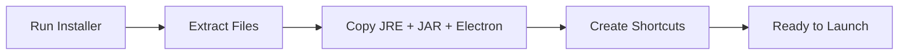
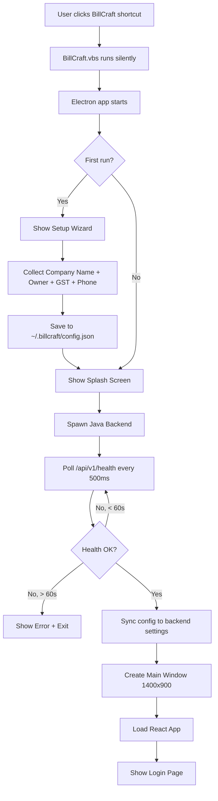
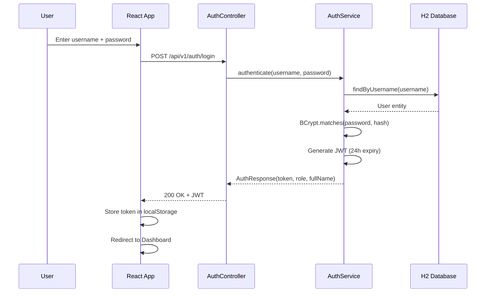
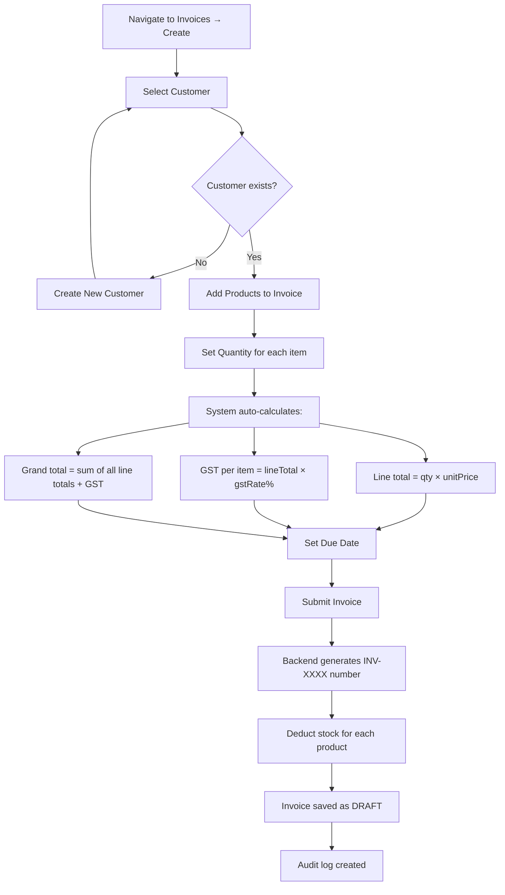
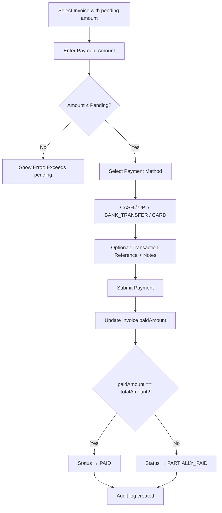
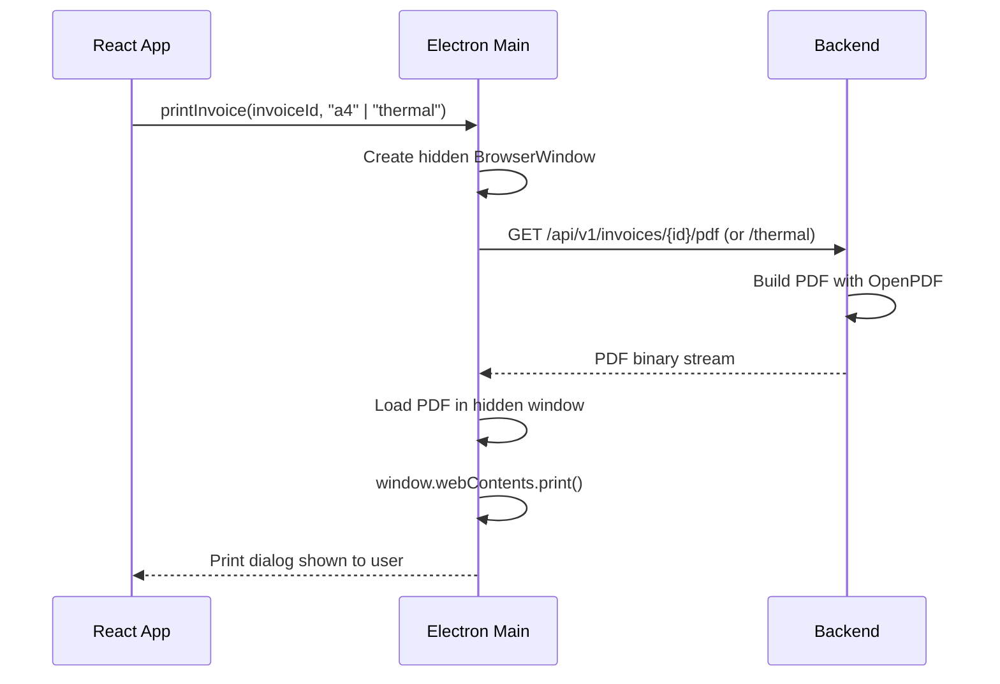
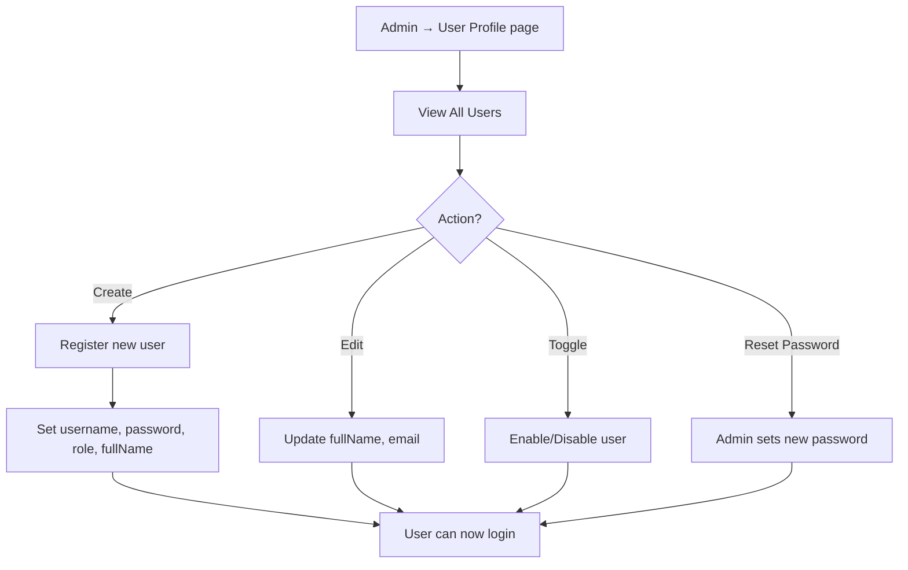
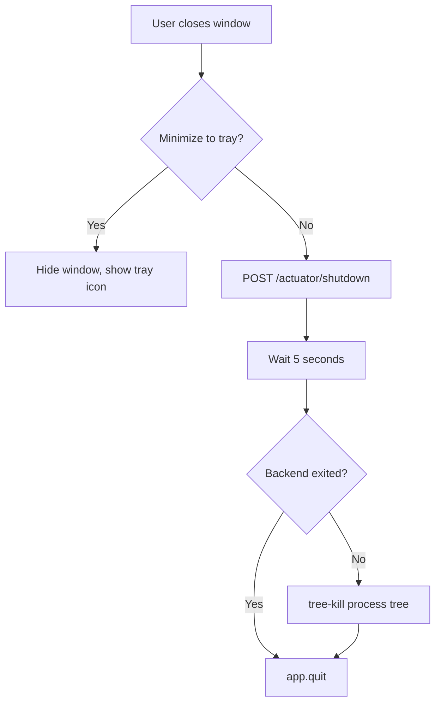

# BillCraft Desktop — Workflow

## Application Lifecycle

### 1. Installation Flow



### 2. Application Startup Flow



### 3. Authentication Flow



**Default Credentials:** `admin` / `admin123`

### 4. Invoice Creation Workflow



### 5. Payment Recording Workflow



### 6. PDF Generation Workflow



**A4 Invoice PDF includes:**
- Company header (name, GST, phone, address)
- Invoice number + date + due date
- Customer details
- Item table (product, qty, rate, GST, total)
- Grand total with GST breakdown
- Payment history (if any)
- Terms and conditions

**Thermal Receipt (80mm):**
- Condensed layout for POS printers
- Configurable paper width (58mm/80mm)

### 7. Backup & Restore Workflow

```mermaid
flowchart TD
    subgraph "Manual Backup"
        A1[Settings → Backup tab] --> B1[Click Create Backup]
        B1 --> C1[H2 SCRIPT TO → SQL file]
        C1 --> D1[Saved to ~/.billcraft/backups/]
    end
    
    subgraph "Auto Backup"
        A2[Scheduled every 24 hours] --> B2[Check backup count]
        B2 --> C2{Count > 50?}
        C2 -->|Yes| D2[Delete oldest backups]
        C2 -->|No| E2[Create backup]
        D2 --> E2
    end
    
    subgraph "Restore"
        A3[Settings → Select backup file] --> B3[Confirm restore]
        B3 --> C3[H2 DROP ALL OBJECTS]
        C3 --> D3[H2 RUNSCRIPT FROM file]
        D3 --> E3[Database restored]
        E3 --> F3[Re-login required]
    end
```



### 8. Report Generation Workflow

| Report Type | Input | Output |
|------------|-------|--------|
| Daily Sales | Date | Revenue, invoice count, payment breakdown by method |
| Monthly Sales | Year + Month | Daily breakdown, total revenue, chart data |
| GST Report | Date Range | Total GST collected, per-invoice GST details |
| Outstanding Dues | None | All unpaid invoices with customer details |
| Payment Analytics | Date Range | Payment method distribution, trends |

**Export Options:**
- Excel (`.xlsx`) via Apache POI
- CSV (`.csv`) via OpenCSV
- PDF (individual invoices)

### 9. User Management Workflow



**Roles:** ADMIN, MANAGER, CASHIER, ACCOUNTANT

### 10. Application Shutdown Flow



## Daily Usage Workflow (Typical Shop)

```
Morning:
  1. Launch BillCraft → Login as admin/cashier
  2. Check Dashboard (today's sales, pending dues)

During Business:
  3. Customer arrives → Search/Create customer
  4. Create Invoice → Add wood products → Set quantities
  5. Record payment (partial or full)
  6. Print invoice (A4 or thermal receipt)
  7. Repeat for each sale

End of Day:
  8. Check Reports → Daily sales summary
  9. Review outstanding dues
  10. Backup (auto or manual)

Monthly:
  11. GST report for filing
  12. Monthly sales analysis
  13. Export data to Excel for accountant
```

## Data Flow Summary

```
User Input → React Page → Axios API Call → Spring Controller
                                                    ↓
                                           Service (business logic)
                                                    ↓
                                           Repository (JPA query)
                                                    ↓
                                           H2 Database (file)
                                                    ↓
                                           Response DTO
                                                    ↓
React Page ← Axios Response ← JSON ← Controller ←──┘
```
